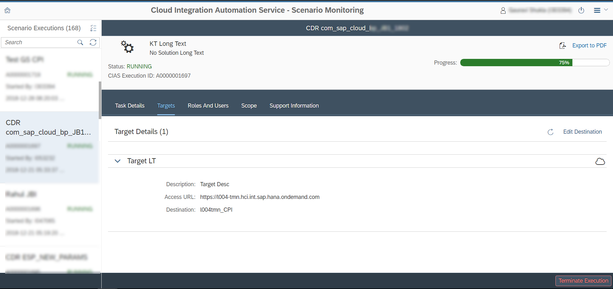
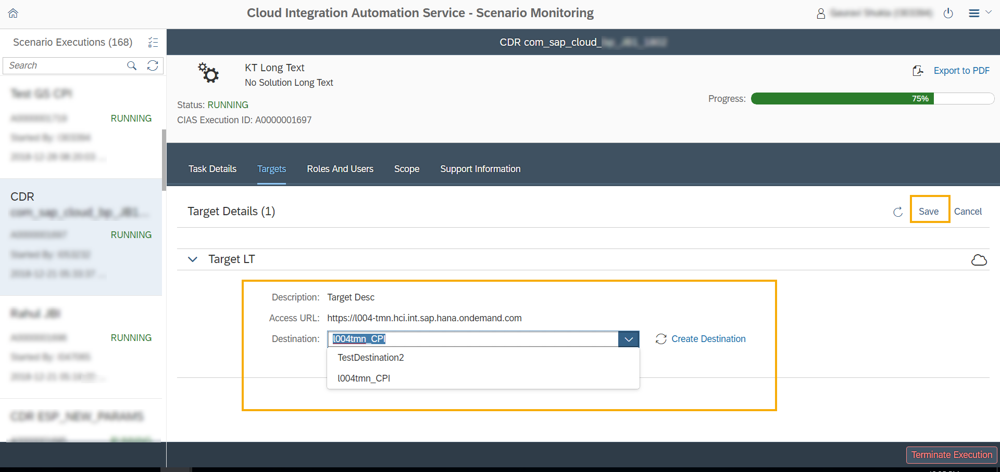

<!-- loiob9d3c0361ca04278a1286939fa4e394a -->

# Add or Change Destination

**Prerequisites:**

You have integration administrator privileges.

At certain points during the scenario execution, you as an integration administrator can change the destination, or enter it if it has not been entered already.

1.  Click the *Targets* tab in the *Scenario Execution Monitoring* application.

2.  Click the *Edit Destination* button.

    

3.  Choose from the available destinations or click *Create Destination* if you want to create a new destination.

    

4.  Click *Save* after you choose the destination.

    > ### Note:  
    > The destination cannot be changed if it is already used in an automation task.

