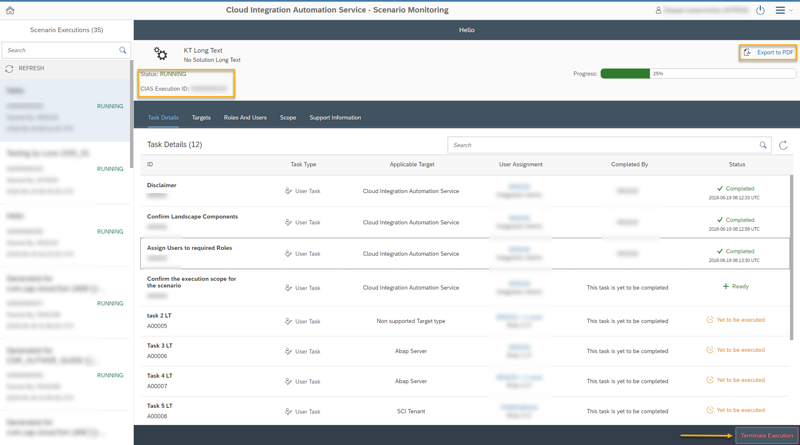

<!-- loio666ddf44bb954b9991ede86daeac08bb -->

# Downloading the Cloud Integration Automation Service Execution Summary Report

You can download the Cloud Integration Automation Service Execution Summary Report as a PDF file to serve as reference for the future, or for auditing purposes.

You can download the report in one of the following ways:

1.  From the My Inbox application:

    Once you have completed all the tasks for a scenario, you will see the *Export to PDF* button in the Execution Summary screen.

2.  From the Scenario Execution Overview application:

    You can download the current execution state of a scenario at any time by clicking the *Export to PDF* button.

