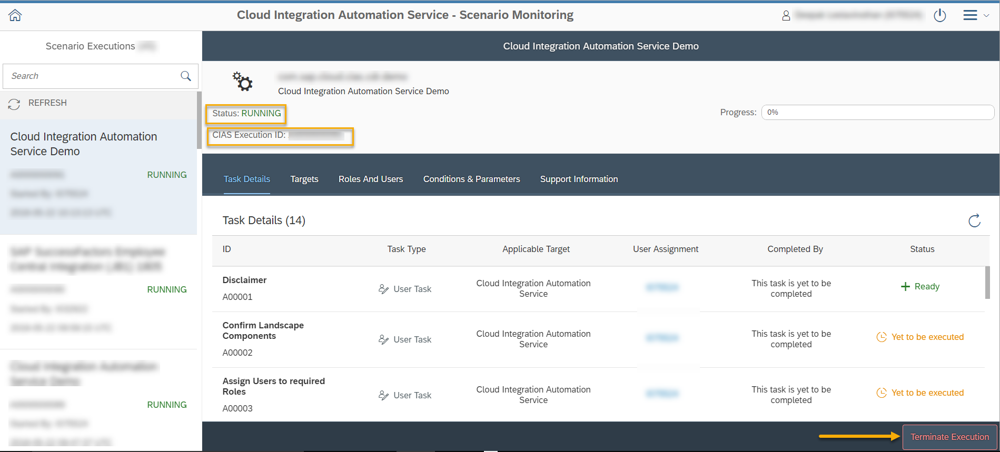

<!-- loiof8daffaf39fb4a12b9230308168d1eb4 -->

# Monitoring Scenario Implementation

This section describes the steps to monitor the scenario implementation.

> ### Note:  
> You need to have **Integration Administrator** or **Integration Monitoring** privileges to be able to view this application.

1.  Select the *Scenario Execution Monitoring* app.

    This app provides a status overview of the active workflow instances. You can view a history of all workflows by filtering it as *Running*, *Completed*, or *Canceled*.

You can also view additional information on the scenario with the following tabs. The tabs visible to you vary based on the scenario:

-   **Task Details**

    If a task status is set to *Not Applicable*, click the link to view the additional details reasoning this status. 

-   **Targets**

-   **Roles and Users**

-   **Scope**

-   **Support Information**

-   **Parameters** \(visible when you choose the task to view additional details\).

You can terminate the scenario execution by clicking the *Terminate Execution* button. Once this is done, you will no longer see the scenario in Cloud Integration Automation service applications.

> ### Note:  
> If a task is assigned to more than one user and one of them has claimed the task, then a padlock icon is displayed next to this user indicating the same. This task cannot be claimed by another user.

<a name="loiof8daffaf39fb4a12b9230308168d1eb4__section_ttc_pnp_h3b"/>

## Comments

This tab contains the comments entered by a user assigned to the task.

<a name="loiof8daffaf39fb4a12b9230308168d1eb4__section_aqw_m1r_3fb"/>

## Logs

You can see the execution logs for an automation task. This provides a detailed overview on the execution and the trials.

To view the logs, choose a task and open the *Logs* tab.

