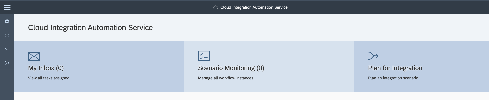

<!-- loio7f7860d7a4334effb53319dfdcb9594e -->

<link rel="stylesheet" type="text/css" href="css/sap-icons.css"/>

# My Inbox

This section describes the steps to access the My Inbox tile and to get started with executing tasks.

> ### Note:  
> You need to have **Integration Administrator** or **Integration Task Expert** privileges to be able to view this tile.

1.  To launch Cloud Integration Automation service application:

    -   Navigate to the SAP BTP Cockpit.
    -   Choose the subaccount where Cloud Integration Automation service is subscribed.
    -   Choose *Instance and Subscriptions* on the side panel.
    -   Under Subscriptions, click the *Go To Application* icon next to Cloud Integration Automation service.

    To find the link, either select the subscription row to view more details about the subscription or click the  \(Go to Application\) icon in the Application column.

2.  Select the *My Inbox* tile.

    

