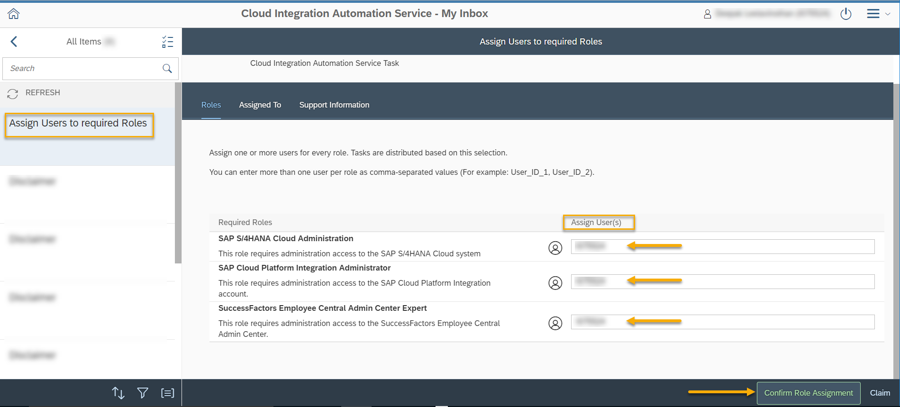
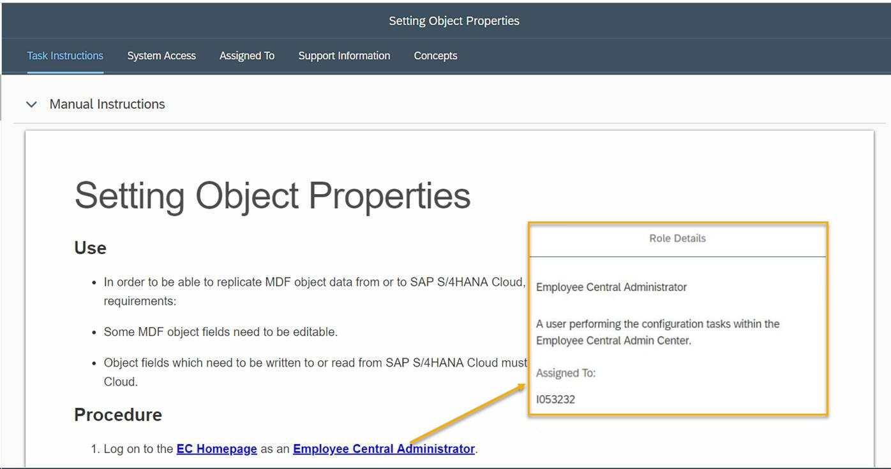

<!-- loiocd6b96bddb4d490391be90b19edb6df9 -->

# Role Assignment

This section describes the steps to assign one or more users to the available roles. You can assign multiple users per role with comma-separated user IDs.

> ### Note:  
> -   Only users with Admin role can view and complete this task.
> -   Users need access to the SAP BTP subaccount to assign roles in Cloud Integration Automation service.
> -   When multiple users are assigned to a task, click *Claim* to lock the task. Once locked, the task is marked as *Reserved* for all the assigned users.

You can view the users assigned to a role in task instructions when executing a task. Clicking the role name displays the role description as well as the list of users assigned to this role. 

