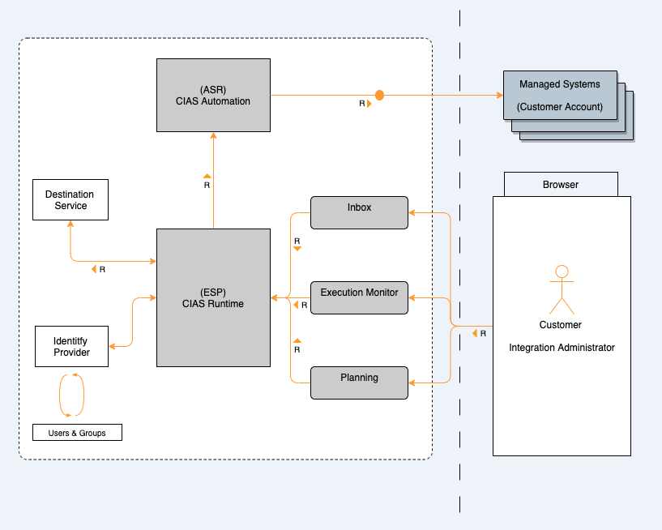

<!-- loiodf151228346d44b9a46bf3c025c8e369 -->

# Security Architecture

The Cloud Integration Automation service consists of the following components that are provisioned into the customer subaccount using the SAP BTP cross-subaccount subscription concept:

-   **Cloud Integration Automation Service Runtime:** The backbone framework that renders your integration tasks.
-   **Cloud Integration Automation Service Planning:** An UI application to plan an integration scenario.
-   **Cloud Integration Automation Service Inbox:** An UI application to access the tasks for an end-user.
-   **Cloud Integration Automation Service Monitoring:** An UI application to access the complete scenario implementation monitoring.
-   **Managed System:** A system to be configured during the integration scenario.
-   **Cloud Integration Automation Service Automation Runtime:** Calls configuration APIs of a managed system.

For more information, see [Multitenant Applications](https://help.sap.com/viewer/65de2977205c403bbc107264b8eccf4b/Cloud/en-US/5e8a2b74e4f2442b8257c850ed912f48.html) in the SAP BTP documentation.

> ### Note:  
> -   Access to all features of the Cloud Integration Automation service offering requires a valid user identity in the corresponding identity provider configured in the customer subaccount where Cloud Integration Automation service is subscribed.
> -   In addition, all backend service connectivity calls that can lead to data manipulation in the Cloud Integration Automation service runtime are protected against cross-site request forgery \(XSRF\).

