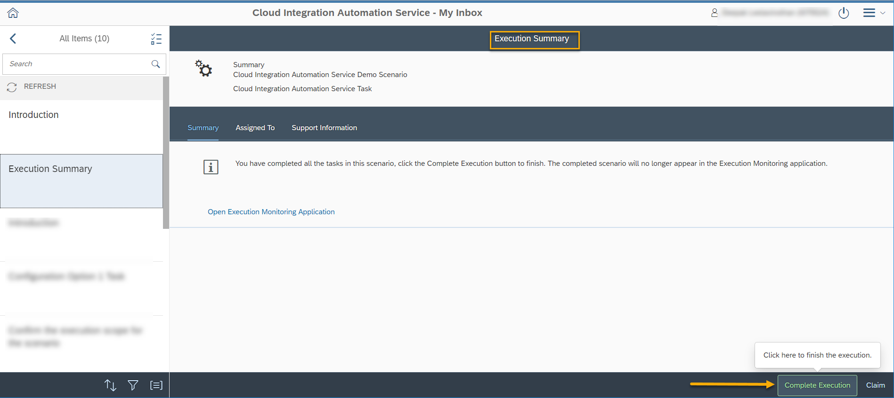

<!-- loio71f9a649ed06412ca960dac09359d64c -->

# Summary

The execution summary screen is the last among the tasks for a scenario.

This screen indicates that you have completed all the tasks for the selected scenario. Click the *Complete Execution* button to mark the scenario as complete.

> ### Note:  
> Once you click *Complete Execution*, the scenario no longer appears in the *Scenario Execution Monitoring* application.

