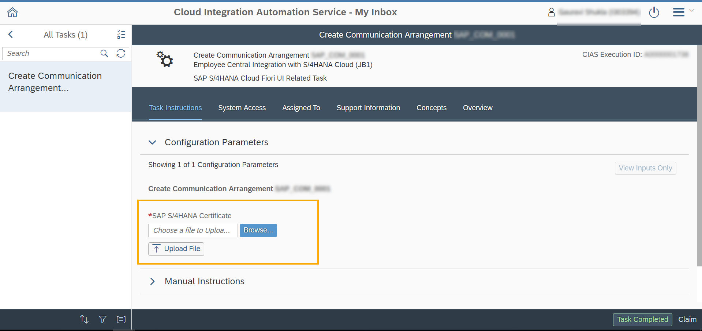

<!-- loio8c2436510b57431aa9a13ab40a7020c9 -->

# Uploading a File in a Task

In the My Inbox application, you can upload certificate files to be reused later by systems in your landscape.

This is useful in scenarios where the same file is needed by any other tasks.

In the *Task Instructions* tab of the My Inbox application, click *Browse* to choose and upload an SAP S/4HANA Certificate.

